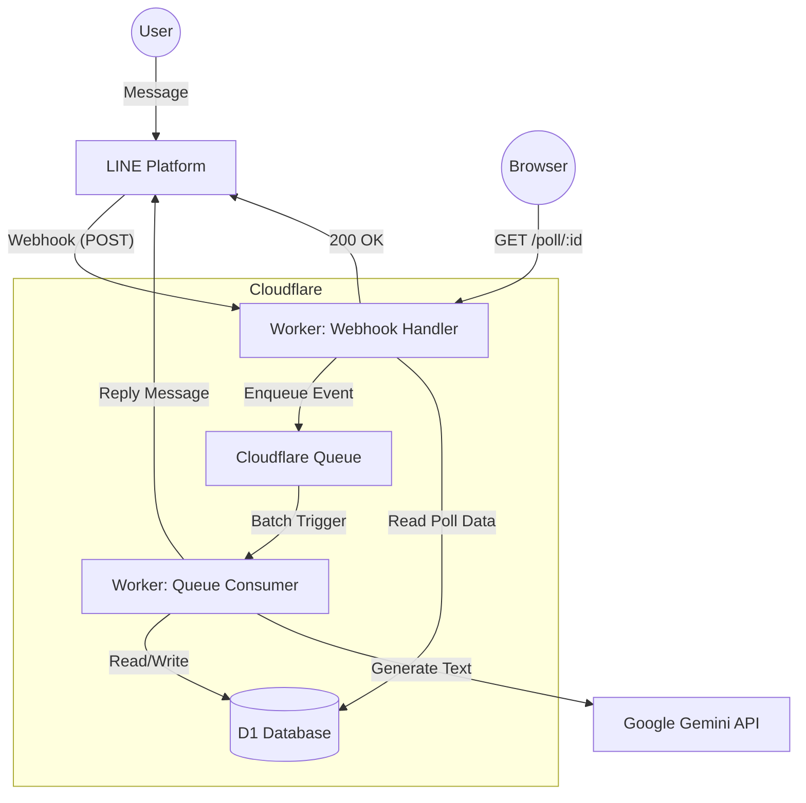
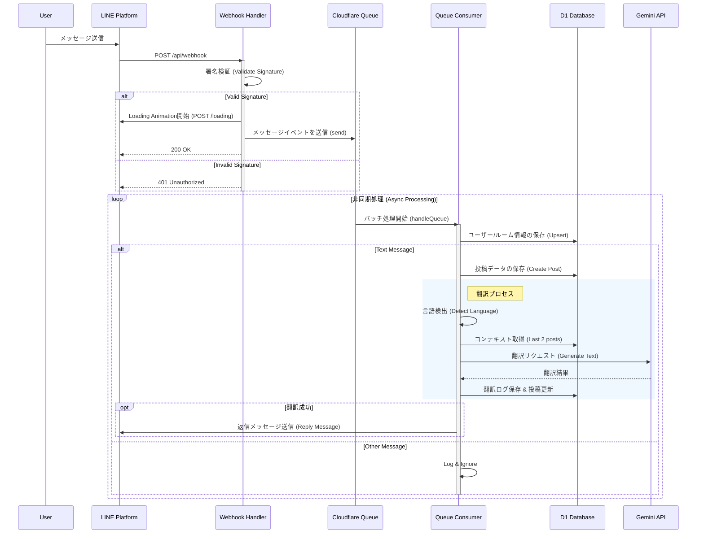
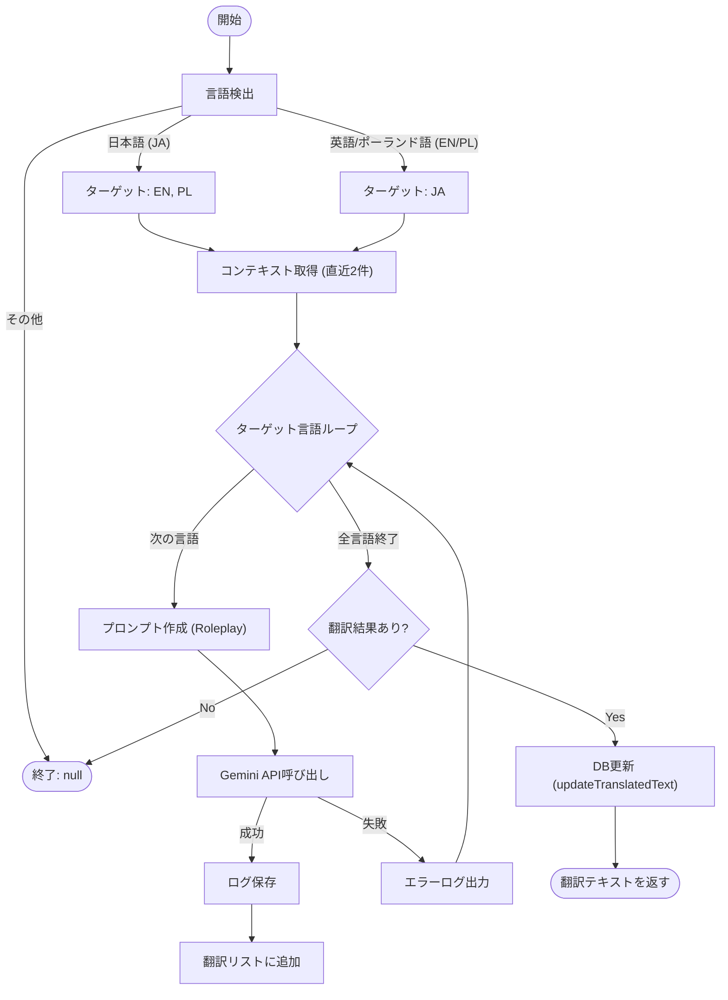
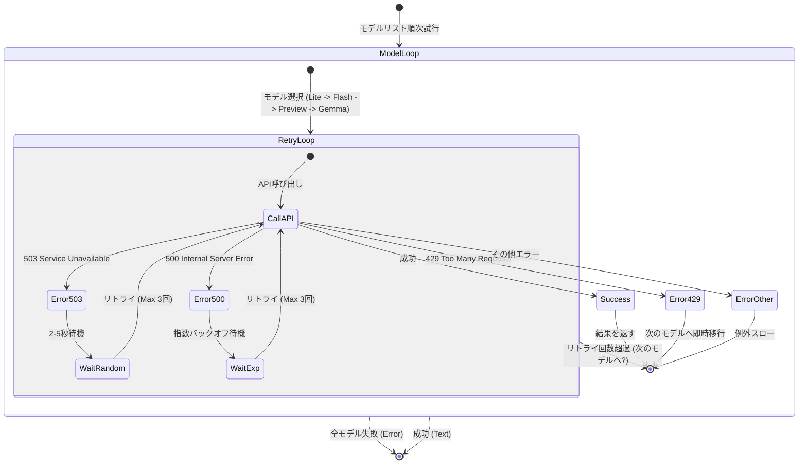
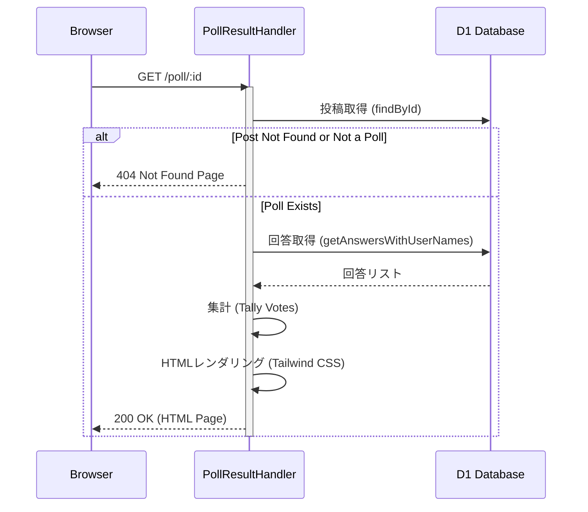

# システムフロー図 (System Flow Diagrams)

本ドキュメントでは、LINE Botシステムの各種フローをmermaid記法による図解で説明します。

## 1. システムアーキテクチャ (System Architecture)

システム全体の構成とデータフローの概要です。

## 2. Webhook & キュー処理フロー (Webhook & Queue Processing Flow)

メッセージ受信から非同期処理、返信までの詳細なシーケンスです。

## 3. 翻訳ロジック (Translation Logic)

`TranslationService` における言語検出と翻訳実行のロジックフローです。

## 4. Gemini API リトライ/フォールバック (Gemini Client Logic)

`GeminiClient` におけるモデルローテーションとエラーリトライの堅牢なロジックです。

## 5. アンケート結果表示 (Poll Result View)

`PollResultHandler` によるアンケート結果ページの表示フローです。

